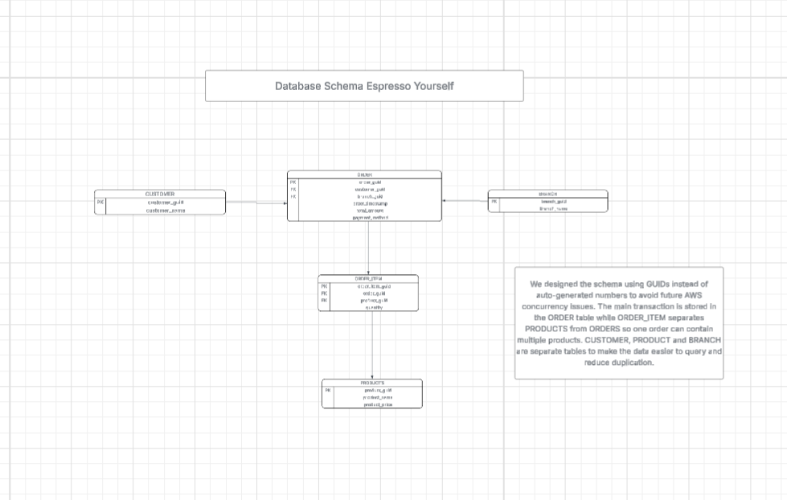

# Espresso_Yourself

## Project Description 

A Data Engineering Team-Project for Generations UK Data Engineer Bootcamp, Developed by Team Espresso_Yourself in DE-NAT4

## Team Members 
Ted 
Sahour 
Ishak 
Suzanne 
Yousaf 

## Activating a venv

## Starting the containers

Put the docker-compose.yml file into the database folder on your virtual machine.

Make sure you have Adminer and Postgres installed.

Run with command docker-compose up.

## Database Schema

